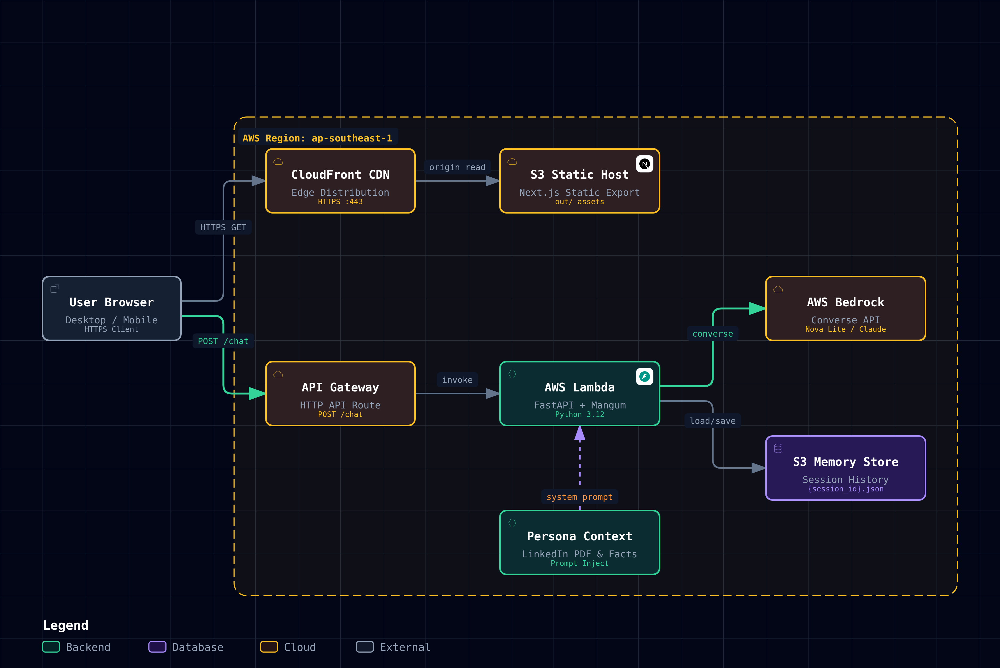

# AI Digital Twin 🤖

An interactive, production-grade AI Digital Twin conversational companion built with **Next.js**, **FastAPI**, **AWS Bedrock**, and **OpenRouter**, deployed entirely as serverless Infrastructure-as-Code using **Terraform** and **GitHub Actions CI/CD**.



---

## ✨ Features

- 💬 **Interactive Conversational AI**: Personalized digital twin with contextual knowledge (LinkedIn profile, professional background, personal style, and factual Q&A).
- 🔄 **Dual LLM Architecture with Automatic Fallback**:
  - **Primary**: AWS Bedrock (`amazon.nova-lite-v1:0` / `amazon.nova-micro-v1:0`)
  - **Fallback**: OpenRouter (`inclusionai/ling-3.0-flash-fin:free`, Llama 3.3, or any OpenAI-compatible model)
- 💾 **Stateful Memory & Session Restoration**:
  - Conversations stored securely in Amazon S3 (or local JSON in development).
  - Fast client-side message caching with zero-latency session recovery upon browser refresh.
- 🎨 **Modern Dark-Mode First UI**:
  - Clean Next.js 16 + Tailwind CSS design.
  - Zero-flicker dark mode default with instant local storage preference persistence.
  - Avatar support, auto-scrolling, and auto-focus input handling.
- ☁️ **Full Serverless Cloud Infrastructure**:
  - **AWS CloudFront**: Fast, globally distributed CDN with SSL.
  - **Amazon S3**: Static website hosting & persistent conversation memory.
  - **Amazon API Gateway HTTP API**: Low-latency REST endpoints.
  - **AWS Lambda**: Serverless Python 3.12 backend packaged via Mangum.
- 🚀 **DevOps & CI/CD**:
  - Multi-environment deployments (`dev`, `test`, `prod`) via **GitHub Actions**.
  - Secure **OIDC Authentication** (keyless, no permanent AWS access keys in GitHub).
  - Remote Terraform state management in **S3** with **DynamoDB** state locking.
  - Automated CloudFront cache invalidation on deployment.

---

## 🏗️ Architecture

```text
                                  ┌───────────────────────────────┐
                                  │      GitHub Actions CI/CD     │
                                  │    (OIDC Keyless AWS Auth)    │
                                  └───────────────┬───────────────┘
                                                  │
                         ┌────────────────────────┴────────────────────────┐
                         │                                                 │
                         ▼                                                 ▼
               Frontend Deployment                               Backend Deployment
         (Next.js Static Export to S3)                      (FastAPI Lambda Package)
                         │                                                 │
                         ▼                                                 ▼
               ┌──────────────────┐                              ┌───────────────────┐
               │  AWS CloudFront  │                              │  Amazon API GW    │
               │   (Global CDN)   │                              │   (HTTP API v2)   │
               └─────────┬────────┘                              └─────────┬─────────┘
                         │                                                 │
                         ▼                                                 ▼
               ┌──────────────────┐                              ┌───────────────────┐
               │  S3 Static Site  │                              │    AWS Lambda     │
               │     Bucket       │                              │ (Python FastAPI)  │
               └──────────────────┘                              └────┬──────────┬───┘
                                                                      │          │
                                       ┌──────────────────────────────┘          │
                                       ▼                                         ▼
                             ┌───────────────────┐                     ┌───────────────────┐
                             │    AWS Bedrock    │ (On Failure)        │    OpenRouter     │
                             │ (Primary Provider)├────────────────────►│(Fallback Provider)│
                             └───────────────────┘                     └───────────────────┘
                                       │
                                       ▼
                             ┌───────────────────┐
                             │  S3 Memory Bucket │
                             │  (Chat Sessions)  │
                             └───────────────────┘
```

---

## 🛠️ Tech Stack

- **Frontend**: Next.js 16, React 19, TypeScript, Tailwind CSS, Lucide Icons
- **Backend**: Python 3.12, FastAPI, Uvicorn, Mangum, Boto3, OpenAI SDK, Pypdf
- **Cloud Infrastructure**: AWS Bedrock, Lambda, API Gateway, S3, CloudFront, DynamoDB, IAM (OIDC)
- **Infrastructure as Code**: Terraform >= 1.0 (AWS Provider ~> 6.0)
- **CI/CD**: GitHub Actions

---

## 📂 Project Structure

```text
twin/
├── .github/
│   └── workflows/
│       ├── deploy.yml            # CI/CD deployment pipeline
│       └── destroy.yml           # Teardown workflow
├── backend/
│   ├── data/                     # Persona context (LinkedIn PDF, facts, style)
│   ├── context.py                # System prompt generator
│   ├── deploy.py                 # Lambda zip packager
│   ├── lambda_handler.py         # Mangum ASGI adapter for Lambda
│   ├── server.py                 # FastAPI application (Bedrock + OpenRouter)
│   ├── pyproject.toml            # Python dependencies (uv)
│   └── requirements.txt          # Lambda requirements
├── frontend/
│   ├── app/                      # Next.js App Router (Layout & Pages)
│   ├── components/
│   │   └── twin.tsx              # Main chat interface component
│   └── public/
│       ├── avatar.png            # Digital Twin avatar
│       └── architecture-diagram  # Architecture visualizer
├── scripts/
│   ├── deploy.sh                 # Local & CI deployment script
│   └── destroy.sh                # Environment teardown script
├── terraform/
│   ├── main.tf                   # Core AWS resources (CloudFront, Lambda, S3, API GW)
│   ├── backend.tf                # Remote S3 state configuration
│   ├── variables.tf              # Input variables
│   └── outputs.tf                # Deployment URLs & resource names
└── ai-digital-twin-system-share-card.png
```

---

## 🚀 Getting Started (Local Development)

### Prerequisites

- [Node.js](https://nodejs.org/) (v20+)
- [Python](https://www.python.org/) (3.12+) & [`uv`](https://docs.astral.sh/uv/)
- [AWS CLI](https://aws.amazon.com/cli/) configured (`aws configure`)

### 1. Clone Repository

```bash
git clone https://github.com/NakitaDev/digital-twin.git
cd digital-twin
```

### 2. Configure Backend

```bash
cd backend
cp ../.env.example .env
```

Edit `backend/.env` with your API keys:
```env
OPENROUTER_API_KEY=sk-or-v1-...
OPENROUTER_MODEL=inclusionai/ling-3.0-flash-fin:free
CORS_ORIGINS=http://localhost:3000
```

Start the backend server:
```bash
uv run uvicorn server:app --reload --port 8000
```

### 3. Configure Frontend

In a new terminal:
```bash
cd frontend
npm install
npm run dev
```

Open [http://localhost:3000](http://localhost:3000) in your browser.

---

## ☁️ Deployment

### Automated Deployment (GitHub Actions)

Deployments are automated through GitHub Actions upon pushing to the `main` branch:

1. Add the following secrets in **GitHub → Settings → Secrets and variables → Actions**:
   - `AWS_ROLE_ARN`: IAM Role ARN created for GitHub OIDC (`arn:aws:iam::<ACCOUNT_ID>:role/github-actions-twin-deploy`)
   - `AWS_ACCOUNT_ID`: Your 12-digit AWS Account ID
   - `DEFAULT_AWS_REGION`: Your primary AWS region (e.g., `ap-southeast-1`)
   - `OPENROUTER_API_KEY`: *(Optional)* Your OpenRouter API key for fallback inference
2. Push your changes:
   ```bash
   git push origin main
   ```
3. GitHub Actions will package the backend, run Terraform, build the Next.js frontend, upload assets to S3, and invalidate CloudFront caches.

### Manual CLI Deployment

```bash
# Deploy to dev environment
./scripts/deploy.sh dev

# Deploy to prod environment
./scripts/deploy.sh prod
```

### Clean Up & Teardown

```bash
# Destroy dev environment
./scripts/destroy.sh dev
```

---

## 📄 License

This project is licensed under the terms of the [LICENSE.txt](LICENSE.txt) file.
